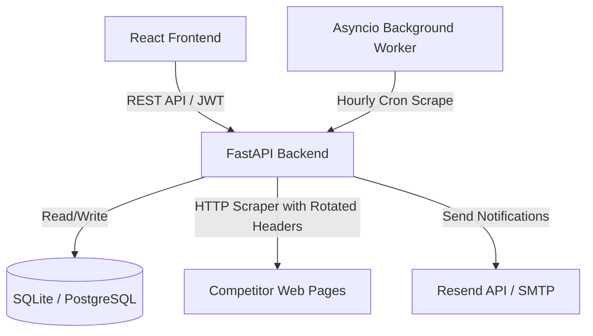

# PricePulse: Automated E-Commerce Competitor Price Monitor & Alerting System

PricePulse is a self-hosted, automated competitor price monitoring and alert system. It allows e-commerce business owners to input competitor URLs, track price deviations against baseline targets, view historical trends, and receive immediate email notifications when a competitor drops their price.

---

## 💡 The Business Value
E-commerce businesses lose thousands in revenue daily by failing to adjust prices relative to their competitors. PricePulse acts as an automated monitoring bot that crawls competitor product pages, runs pricing drop calculations, and dispatches real-time alerts so store owners can match or beat competitor deals instantly.

---

## 🛠️ System Architecture



---

## ✨ Features

- **Automated Price Crawling**: Custom scraping module powered by **BeautifulSoup4** and **Requests** targeting:
  - `books.toscrape.com` (Book details)
  - `webscraper.io` sandbox catalogs (Electronics, Phones)
  - `Amazon` & `Flipkart` (Supports simulated crawl mode to bypass aggressive bot blocks)
- **Rotated Headers Engine**: Dynamic header rotation (`User-Agent`, `Accept-Language`, etc.) to mimic human users.
- **Anti-Spam Alert State Machine**: Prevents inbox spam. Dispatches an email alert only on first-time price drops or when a competitor drops their price to a *new, deeper low*. Automatically resets state when the competitor price recovers.
- **Safety Crawler Health Tracking**: Automatically tracks crawl errors and logs error messages. Auto-disables tracking links if they fail 5 consecutive times to prevent account blocks.
- **Polished Dark-Mode Dashboard**: Grid-layout built with **React**, **TypeScript**, and **Tailwind CSS**.
- **Interactive Price Timelines**: Powered by **Recharts**, plotting store baseline target prices alongside multiple competitor price curves.
- **Sent Alerts Log**: Live notifications log directly inside the browser client.

---

## 🗄️ Database Schema Design

PricePulse supports out-of-the-box **SQLite** for easy local development, and is fully configured to connect to **PostgreSQL** via environment variables.

### Table Schema Definition

```sql
-- 1. Users
CREATE TABLE users (
    id UUID PRIMARY KEY DEFAULT gen_random_uuid(),
    email VARCHAR(255) UNIQUE NOT NULL,
    hashed_password VARCHAR(255) NOT NULL,
    created_at TIMESTAMP WITH TIME ZONE DEFAULT CURRENT_TIMESTAMP
);

-- 2. Products
CREATE TABLE products (
    id UUID PRIMARY KEY DEFAULT gen_random_uuid(),
    user_id UUID REFERENCES users(id) ON DELETE CASCADE,
    name VARCHAR(255) NOT NULL,
    target_price NUMERIC(10, 2) NOT NULL,
    alert_threshold_percent NUMERIC(5, 2) DEFAULT 5.00,
    is_active BOOLEAN DEFAULT TRUE,
    created_at TIMESTAMP WITH TIME ZONE DEFAULT CURRENT_TIMESTAMP
);

-- 3. Competitor URLs
CREATE TABLE competitor_urls (
    id UUID PRIMARY KEY DEFAULT gen_random_uuid(),
    product_id UUID REFERENCES products(id) ON DELETE CASCADE,
    url TEXT NOT NULL,
    domain_selector_key VARCHAR(50) NOT NULL,
    last_scraped_price NUMERIC(10, 2),
    last_scraped_at TIMESTAMP WITH TIME ZONE,
    last_notified_price NUMERIC(10, 2),
    error_count INT DEFAULT 0,
    last_error_message TEXT,
    is_active BOOLEAN DEFAULT TRUE
);

-- 4. Price History
CREATE TABLE price_history (
    id UUID PRIMARY KEY DEFAULT gen_random_uuid(),
    competitor_url_id UUID REFERENCES competitor_urls(id) ON DELETE CASCADE,
    price NUMERIC(10, 2) NOT NULL,
    scraped_at TIMESTAMP WITH TIME ZONE DEFAULT CURRENT_TIMESTAMP
);

-- 5. Sent Alerts
CREATE TABLE sent_alerts (
    id UUID PRIMARY KEY DEFAULT gen_random_uuid(),
    product_id UUID REFERENCES products(id) ON DELETE CASCADE,
    competitor_url_id UUID REFERENCES competitor_urls(id) ON DELETE CASCADE,
    previous_price NUMERIC(10, 2),
    new_price NUMERIC(10, 2) NOT NULL,
    price_drop_percent NUMERIC(5, 2) NOT NULL,
    recipient_email VARCHAR(255) NOT NULL,
    sent_at TIMESTAMP WITH TIME ZONE DEFAULT CURRENT_TIMESTAMP
);
```

---

## 🚀 Getting Started (Local Setup)

### Prerequisites
- Python 3.10+
- Node.js 18+

---

### 1. Backend Setup (FastAPI)

1. Navigate to the backend directory:
   ```bash
   cd backend
   ```
2. Create and activate a virtual environment:
   ```bash
   python -m venv venv
   # On Windows:
   .\venv\Scripts\activate
   # On Unix/macOS:
   source venv/bin/activate
   ```
3. Install dependencies:
   ```bash
   pip install -r requirements.txt
   ```
4. Configure Environment Variables (Optional):
   Create a `.env` file in the `backend/` directory:
   ```env
   DATABASE_URL=sqlite:///./pricepulse.db
   SECRET_KEY=your_jwt_secret_key_here
   RESEND_API_KEY=your_resend_api_key_here
   SENDER_EMAIL=alerts@yourdomain.com
   ALERT_THRESHOLD_PERCENT=5.0
   SCRAPE_INTERVAL_SECONDS=3600
   ```
5. Start the FastAPI Uvicorn Server:
   ```bash
   python -m uvicorn app.main:app --host 127.0.0.1 --port 8000
   ```
   *Uvicorn will run at [http://127.0.0.1:8000](http://127.0.0.1:8000). Documentation is available at `/docs`.*

---

### 2. Frontend Setup (React)

1. Navigate to the frontend directory:
   ```bash
   cd ../frontend
   ```
2. Install Node packages:
   ```bash
   npm install
   ```
3. Run the development server:
   ```bash
   npm run dev
   ```
   *The client will launch at [http://localhost:5173/](http://localhost:5173/).*

---

## ⚡ Demo Testing Guide (Bypassing Captchas)
Amazon and Flipkart employ aggressive bot blocks. To test the alerting calculations and the dashboard charts instantly, append the **`?mock=true`** query parameter when registering competitor links:

*   **Amazon Link (Simulated)**: `https://www.amazon.com/dp/B0CHX75B76?mock=true`
*   **Flipkart Link (Simulated)**: `https://www.flipkart.com/apple-iphone-15-pro-black-titanium-128-gb/p/itm548b?mock=true`

The scraper will immediately succeed, generate a simulated price, register the price history node, and trigger a drop alert if it falls below your baseline!

---

## 🧪 Running Tests
We use `pytest` for unit testing. Navigate to the `backend/` directory and run:
```bash
.\venv\Scripts\python -m pytest
```
Tests cover:
- CSS selector scraping and price sanitization.
- Non-spam state machine alert logic checks.
